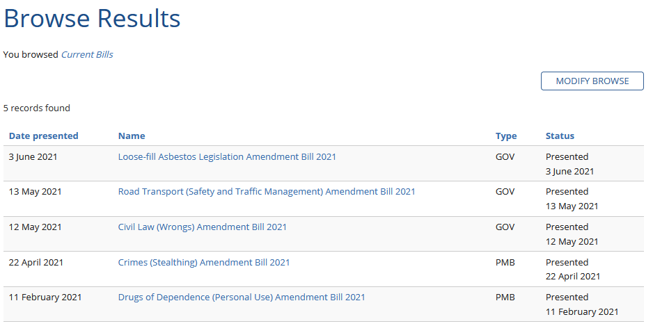
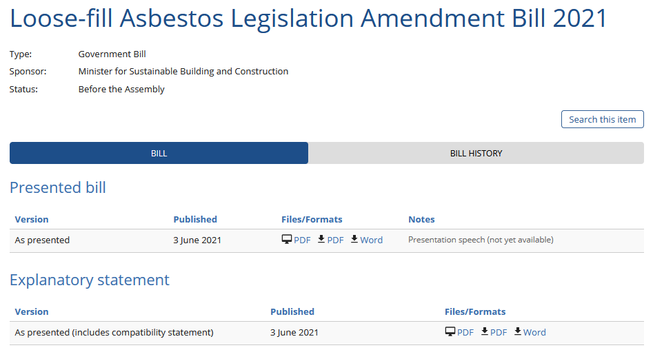

# ausbills

🇦🇺 This is a package is for obtaining parliament bills for Australian parliaments.

## Install via pip

```
pip install ausbills
```

---

## Usage

#### _All parliaments' extractors must use the same output template, which can be found [here](ausbills/models.py)._

Most parliaments host their bills online in 2 forms:

1. A table with a small amount of data about each bill

   

2. Individual pages with all the info for a given bill.

   

`ausbills` gives you access to all of this information.

To get all the current bills from a parliament, follow this template. The ACT parliament is used here for example purposes, all parliaments follow the same rules:

```py
# First, we'll import the functions we need:
from ausbills.parliament.act import get_bills_metadata, get_bill
```

`get_bills_metadata` is the function which returns the list of bills with whatever metadata is present on the list web page.

```py
# Let's print out the list of current bills in the ACT:
print(get_bills_metadata())
```

This is nice, but we can see from the previous screenshots that there is more data that can be obtained, which can be done by using the `get_bill` function's `dict` or `JSON` return functions:

```py
# Get the full metadata from a random ACT bill:
import random

random_bill = random.choice(get_bills_metadata())

print(get_bill(random_bill).asDict())

```

We could construct a `JSON` structure for all the bills in the list with all their metadata like ths:

```py
import json

all_bills = get_bills_metadata()
bill_meta_list = [get_bill(_bill).asDict() for _bill in all_bills]

print(json.dumps(bill_meta_list, indent=2))
```

See [this example](examples/download_all_wa_bills.py) for an implementation of this demo for the WA parliament.

---

## Contributing

Read [CONTRIBUTING.md](CONTRIBUTING.md)
